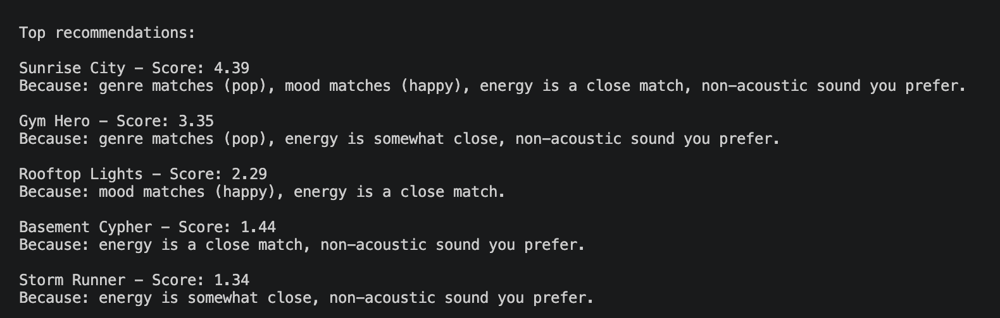
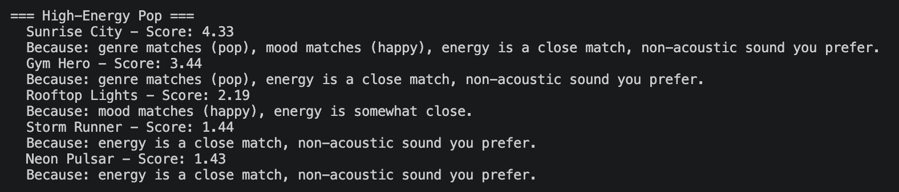
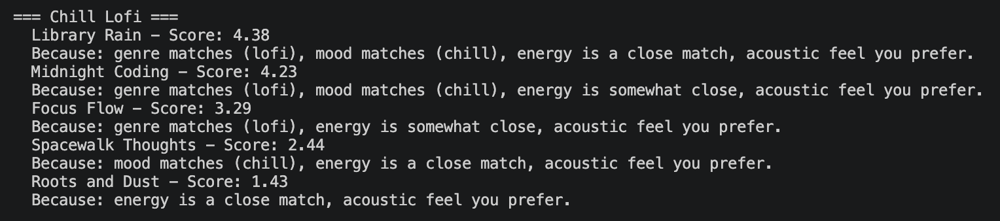
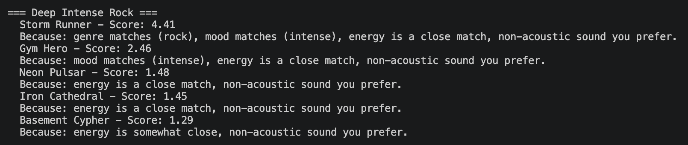
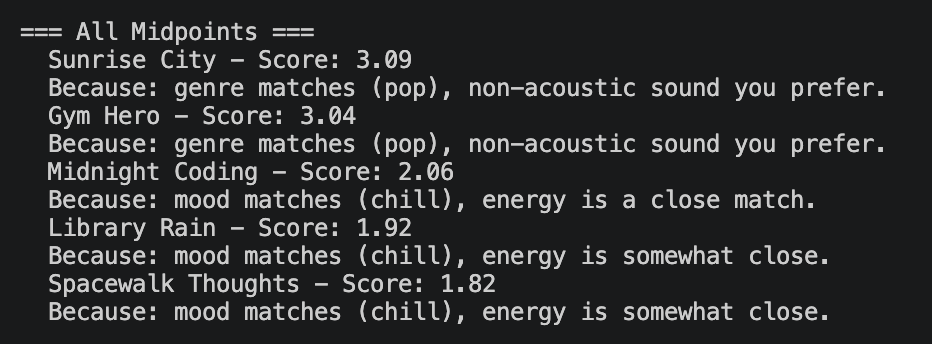
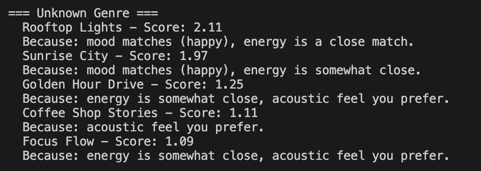
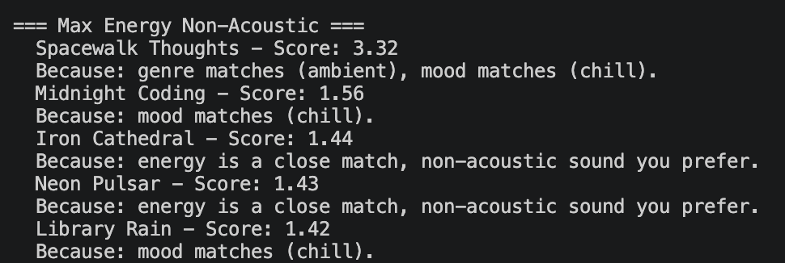

# 🎵 Music Recommender Simulation

## Project Summary

In this project you will build and explain a small music recommender system.

Your goal is to:

- Represent songs and a user "taste profile" as data
- Design a scoring rule that turns that data into recommendations
- Evaluate what your system gets right and wrong
- Reflect on how this mirrors real world AI recommenders

Replace this paragraph with your own summary of what your version does.

---

## How The System Works

Explain your design in plain language.
My design compares each song in the catalog against a user's taste profile across five features, computes a match score for each song, and returns the top-ranked results.

Some prompts to answer:
- What features does each `Song` use in your system
Each Song carries two types of features:
* Categorical — genre and mood. These are exact-match signals-a song either shares the user's preferred genre/mood or it doesn't.
* Numeric — energy, valence, danceability, and acousticness. All are on a 0 to 1 scale. These are scored by closeness to the user's target value, not by being high or low.

- What information does your `UserProfile` store
The UserProfile holds the user's taste preferences — not their listening history, just what kind of music they like. Some examples include:
* favorite_genre
* favorite_mood
* target_energy
* likes_acoustic

- How does your `Recommender` compute a score for each song
1. For each song in the catalog, run a scoring rule — comparing the song's energy, genre, mood, etc. against the user's profile values
2. Categorical matches (genre, mood) contribute a fixed bonus (e.g. +1.0 if it matches, 0 if not)
3. Numeric features use 1 - |song_value - user_target| (or Gaussian decay) to score closeness
4. Those per-feature scores are combined into one weighted total score per song

- How do you choose which songs to recommend
1. Score every song in the catalog
2. Sort all songs by score, highest first
3. Return the top k (default 5, configurable)

You can include a simple diagram or bullet list if helpful.

---

### How Recommendations Are Chosen

For every song in the catalog, compute a score using the following rules, then sort descending and return the top `k`:

```
score = 0.0

if song.genre == user.favorite_genre  →  score += 2.0
if song.mood  == user.favorite_mood   →  score += 1.0

energy_score   = 1.0 - abs(song.energy - user.target_energy)
score += energy_score                                          # up to +1.0

if user.likes_acoustic:
    score += song.acousticness * 0.5                          # up to +0.5
else:
    score += (1.0 - song.acousticness) * 0.5                  # up to +0.5

# Max possible score: 4.5
```

**Weight rationale:**
- Genre (`+2.0`) is the strongest signal — a metal fan and a lofi fan have near-zero overlap even when other features align.
- Mood (`+1.0`) cuts across genres (e.g., both `lofi` and `ambient` share `chill`), so it's a softer filter.
- Energy proximity (`≤+1.0`) rewards closeness on a continuous scale — same max as mood to keep categoricals dominant.
- Acoustic preference (`≤+0.5`) is a background nudge, not a dealbreaker.

---

### Expected Biases

| Bias | Why it happens | Effect |
|---|---|---|
| **Genre over-dominance** | Genre carries 2× the weight of any other signal | A perfect mood + energy match (max 2.0 pts) can't beat a genre-only match (2.0 pts), so great cross-genre songs get buried |
| **Catalog genre imbalance** | `songs.csv` has more lofi/pop/ambient entries than metal or blues | Users with niche genre preferences (e.g., `blues`) get fewer strong matches, making recommendations feel generic |
| **Acoustic preference is one-directional** | `likes_acoustic` is a binary flag — there's no "neutral" option | Users who don't care about acousticness still get penalized or rewarded based on it |
| **No diversity enforcement** | Top-k is a pure score sort | All 5 recommendations could be from the same genre/artist if they score highest, reducing variety |


## Getting Started

### Setup

1. Create a virtual environment (optional but recommended):

   ```bash
   python -m venv .venv
   source .venv/bin/activate      # Mac or Linux
   .venv\Scripts\activate         # Windows

2. Install dependencies

```bash
pip install -r requirements.txt
```

3. Run the app:

```bash
python -m src.main
```

### Running Tests

Run the starter tests with:

```bash
pytest
```

You can add more tests in `tests/test_recommender.py`.

---
## 📸 Demos



### High-Energy Pop


### Chill Lofi


### Deep Intense Rock


### All Midpoints


### Unknown Genre


### Max Energy Non-Acoustic


---

## Experiments You Tried

Use this section to document the experiments you ran. For example:

- What happened when you changed the weight on genre from 2.0 to 0.5
- What happened when you added tempo or valence to the score
- How did your system behave for different types of users

**My Experiments:**
- Lowering genre weight from 2.0 to 0.5 made results more diverse but let wrong-genre songs sneak into the top 5.
- Adding a valence proximity term shifted rankings — high-energy/low-valence songs dropped, showing energy and valence aren't redundant.
- A pop/happy user got clean results; a blues/melancholy user only got 1–2 real matches because the catalog barely covers that genre.

---

## Limitations and Risks

Summarize some limitations of your recommender.

- Catalog skews toward lofi/pop/ambient — niche genre users get poor results regardless of scoring logic.
- `likes_acoustic` is binary; users who are indifferent still get penalized or rewarded.
- No diversity enforcement — all 5 recommendations can be near-identical songs.
- No feedback loop; the system never learns from whether a recommendation was actually enjoyed.

You will go deeper on this in your model card.

---

## Reflection
Read and complete `reflection.md`:
[**Reflection.md**](reflection.md)


Write 1 to 2 paragraphs here about what you learned:

- about how recommenders turn data into predictions
- about where bias or unfairness could show up in systems like this

Building this system made it clear that a recommender is only as good as the assumptions baked into its weights and data. Every weight (genre at 2.0, mood at 1.0) is a human judgment call — the formula looks objective, but it reflects choices about what matters most. The blues-fan profile getting weak results wasn't a bug in the formula; it was a bias in the catalog that no scoring rule could fix.

The subtler lesson was about invisible assumptions. The binary `likes_acoustic` flag quietly affects every user, even those who never expressed an opinion. Real recommenders make the same kind of choice at scale, meaning small design decisions can disadvantage entire groups without anyone noticing. Fairness isn't just about avoiding obvious bias — it's about recognizing whose preferences shaped the system from the start.

---

## 7. Model Card

Read and complete `model_card.md`:
[**Model Card**](model_card.md)
